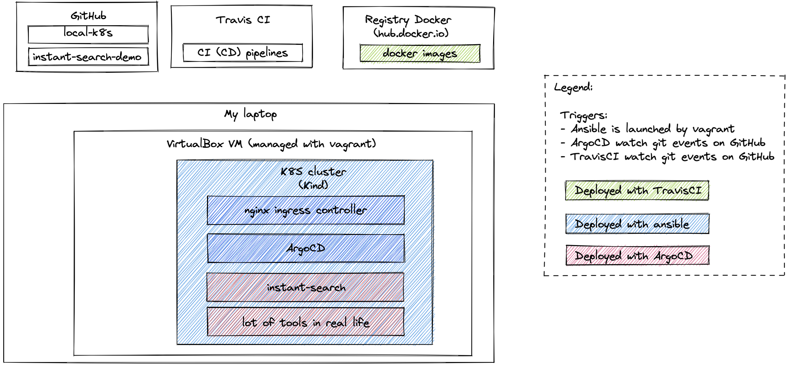

# Yohan Lascombe implementation of Algolia assignment

This repository contains code to build a mini infrastructure (based on a local Kubernetes) to host instant-search-demo application.
It will contains also comments of my work.

# Prerequisites

* vagrant (with an hypervisor behind)
* plugin vagrant
    * `vagrant plugin install vagrant-hostmanager`
* python virtualenv

```sh
virtualenv -p python3 venv
source venv/bin/activate
pip3 install -r requiremments.txt
```

# Launch locally

Temporarly to simulate DNS record:
```sh
echo "192.168.121.60  argocd.localhost argocd.mycluster.algolia  instant-search.mycluster.algolia" | sudo tee -a /etc/hosts
```

Create VM and install Kubernetes on top :
```bash
vagrant up
```

Wait for vagrant and ansible ends without error and then check in ansible logs login/password (printed just for demo here) and then
authenticate on [ArgoCD](https://argocd.mycluster.algolia/)

## Optional - Force ansible relaunch

If required, you could launch ansible (and docker provisioner) with the following command:
```sh
vagrant provision
```

# Main steps

As I don't know exactly how much time is needed to achieve this assignment (and also how much time I can spent) : I have cut my work on somes steps. I choose to work first on things I estimate most prio. So here the steps I see:
1. [x] understand what is the subject apps (run locally and look rapidly code)
1. [x] launch app locally with docker (and docker-compose)
1. [x] build docker image with CI
1. [x] deploy app on Kubernetes running on my laptop (with Kind)
1. [x] instrument (with infra as code) how to initialize and run a local Kubernetes cluster
1. [ ] configure logs management, monitoring for app in cluster 

In a real context, all these tasks should be done only with CI/CD pipelines.

# Tradeoff
* Will use vagrant to launch VM locally (because it is the most rapid (or at least a rapid one) way to deploy a Virtual Machine): but a tool focused on desired state configuration will be better (terraform for example)
* In order to install middlewares (aka kubernetes on VM), some solutions are possible (minikube, shell script, ansible, prepacked VM with packer, docker-compose...)  I will use ansible provisionner to deploy middlewares on this VM 


# Session 1 : lookup project and run it

## Session Goals
For the first session, my objective are:
* understand what is the app and run it locally
* setup a first CI (without CD for now) pipeline to build docker image and publish it on docker registry (hub.docker.com)

## Choices
* why to use container ? ? for me it is almost a standard and I want to use Kubernetes to deploy the app on the next session
* why using `docker` to manage containers ? on dev laptop, it is still lot used because it is simple and fast. (docker is less and less used on real servers)
* why `docker-compose` ? at first seen, I had identified 2 components : a front and a ruby part to inject test data. So use docker-compose directly enable to manage them directly.
* I had seen a `.travis.yml` file exists on repository, I am used to play with gitlab (and gitlab-CI) for quite all my projects, so I will take advantage of this exercise to find out TravisCI

## Achievements
* Basics `Dockerfile` and `docker-compose.yml` that enable to launch app locally rapidly
* Simple CI pipeline on TravisCI to build docker image and launch some tests (Trivy for security scan and npm security audit)

# Session 2: setup local Kubernetes to run the application

## Session Goals
In the assignment description, it is written that it should be appreciated if the work can launched locally. Deploy on the cloud apps is quite the default (and easiest way) to deploy apps. 
So, I will try to create a local cluster with code.

## Choices
* not trivial one : which distribution/packaging of kubernetes to use ? I have considered K3S, microk8s, Kind and minikube as a short list. I choose Kind for this assignment. 
    * `minikube` is a good choice but I prefer to use a not VM related solution.
    * `microk8s` could be a good choice but I want to not be linked to an operating system because for me the VM here is useless and we could directly launch Kubernetes on developer machine, so a cross operating system solution will be nicest : as far as I know, microk8s is available only with ubuntu.
    * `k3s` was really interesting but in fact I want to use a solution full dockerized : so Kind decide me to use it. 
If I have to choose again, I do not konw if I do the same choice.
* As it is written deploy on a local VM for example on assignement, I have decided to complexify a little more the setup by hosting the Kubernetes cluster oln a virtual machine (I consider it is not a good choice) but I recommend to not use a virtual machine.
* I am using `vagrant` to manage my hypervisor (VirtualBox) : it is only because I had already used this tool, but for me the good choice will be a `terraform` like tool since it will be probably used to manage real environment. 
I had seen [this repo](https://github.com/bmatcuk/terraform-provider-vagrant) to launch vagrant with terraform but I consider that too complex, for me the best is to replace vagrant by terraform and not launch vagrant with terraform.
* in vagrant, I have configured 2 provisionners : 
    * `docker` : just to install docker
    * `ansible`: install and configure tools required (kubectl, helm, kind, instanciate cluster, deploy ingress controller, deploy argocd)

## Achievements
* vagrant create a VM and launch ansible
* ansible install a mono-node kubernetes cluster and deploy nginx ingress controller and argocd on top
* some bad network configuration to allow host machine to access to VM and some disabling of TLS to can access to argocd without HTTPS (else a valid DNS is required to generate SSL certificate with cert-manager for example)

## Session note
I had installed nginx ingress controller and argocd with ansible (as it is already used for VM) but it will be probably the first thing I will replace with terraform I have to work again on this project.


# Session 3: make the CD part of the pipeline with ArgoCD

## Session Goals
Configure a project and a repository in ArgoCD to deploy instant-search app

## Choices

* I have configured a project and appproject even if there is only one component yet
* AppProject for instant-search-demo is configured to sync automatically and currently helm template use a static version. Multiple implementation could be done to managed version (we will probably talk about that later ;-) )

## Achievements
* instant-search-demo app is deployed without any intervention by argocd. 

# Architecture

## Local architecture (current)


## Target architecture (not implemented)

### Layering 


> For convenience, in sent version, `local-k8s` repository contains also a little part of `k8s-apps` that is designed here.

# What is missing here

On synthesis, I had lost a lot of time to build a solution based on a VirtualMachine. By reading again the assignement, it was not an expectation. If I had to redo my work, so I will skip VM and I will use only docker + Kind + terraform + argocd.

More detailed : 
Lot of things are missing if we want to use really this project. It's difficult to list all, so I will try to enumerate topics:
* provision layer
    * on local VM
        * replace (or miniminize) vagrant usage : currently vagrant calls docker and ansible provisioner to end VM configuration, for me the best practice is to isolate each layer (provision/gconf, app deploy)
        * I had implemented a VM to follow assessments instructions but for me VM could be easily replaced by container that runs directly kubernetes : it is one reason for which I had choose to use Kind to implement Kubernetes cluster
    * on real env (on cloud)
        * write terraform code to provision resources on cloud
* GConf/middlewares layer
    * even if I like ansible, it is often replaced by GitOps tools (which follow fully/better desired state configuration)
    * cert-manager (or similar one) is really missing, here I forced myself to use only HTTP (without secured) queries but I am not proud of that.
* Applicative layer
    * I could have take time to upgrade node and dependencies version
    * I did not have used simplified version of app
    * some variable (or secret) could be extracted from code (for example Google Analytics Id), use env var with docker could be a good way     (`envsubst` is often usefull ;-) )
    * I do not really care about `dataset_import` module : it should be nice to take some time to configure it
* CI/CD pipeline: please look next paragraph for main things
    * I had discovered too late (time is missing to fix it) TravisCI have a feature to encyrpt secrets instead of using env vars.
* Day-2 tools:
    * monitoring: `prometheus/grafana` is missing : I didn't have configured requests/limits resources on the deployment since I normally use monitoring to define the rights quota
    * logs: `Elastic/F**/Kibana` or `Loki` should be used

## Target CI/CD Pipeline:

Sent version of my assignement is very basic, in real life, I will enjoyed to talk to dev team to understand what they needs and want and help to implements it. Below are some features that are missing for me : 

### Tests pyramid
I don't seen tests in given code. Unfortunately, it not exceptional. But tests are really usefull. Automated tests should be added for each new feature or bugfix
* priorize unit test
* integration test
* end to end tests must be coded with parcimony

### Security tools
* [ ] Software Composition Analysis (SCA) : detect component (framework/package) with known issues : `npm audit`
* [x] Container Composition Analysis (CCA) : detect middleware with known issues : `clair` or `trivy`
* [ ] Static Application Security Testing (SAST) : detect bad usage of language or framework (by source code analysis of applications) which could causes applicative issues (XSS, SQLi, …) : `eslint security`
* [ ] Dynamic Application Security Testing (DAST) : execute security tests in order to identify configuration error (HTTPS config, cookie setting...) at infra or applicative level : `ZAP`
* [ ] Runtime application self-protection (RASP) : security framework, included in application, which check app configuration and intercept each query to analyse them: `OpenRASP (Baidu)`

### Code quality

* tool like sonar qube

### CI/CD pipeline conform with Git workflow used by team
* CI/CD pipeline is specific for each team


